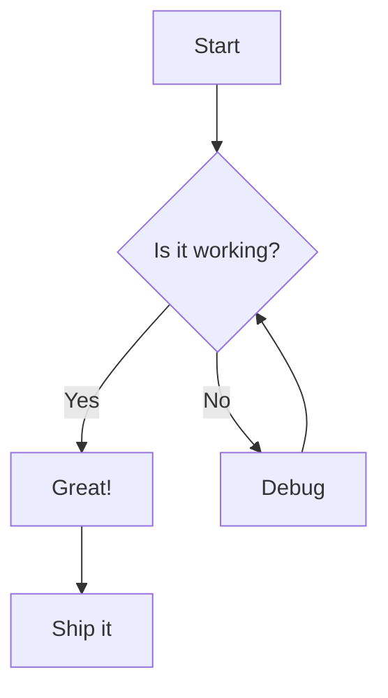
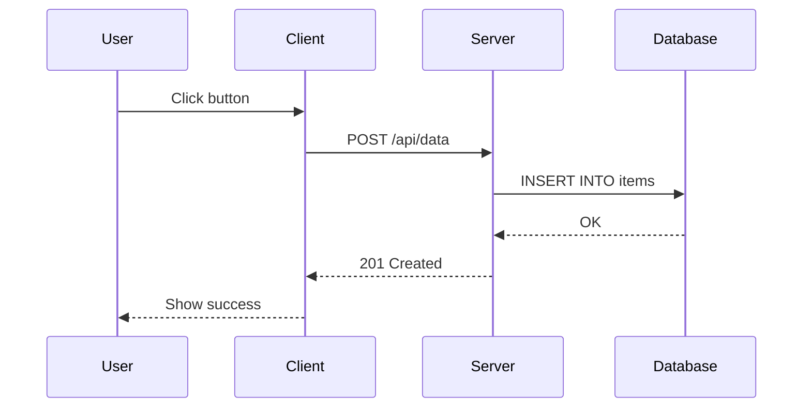
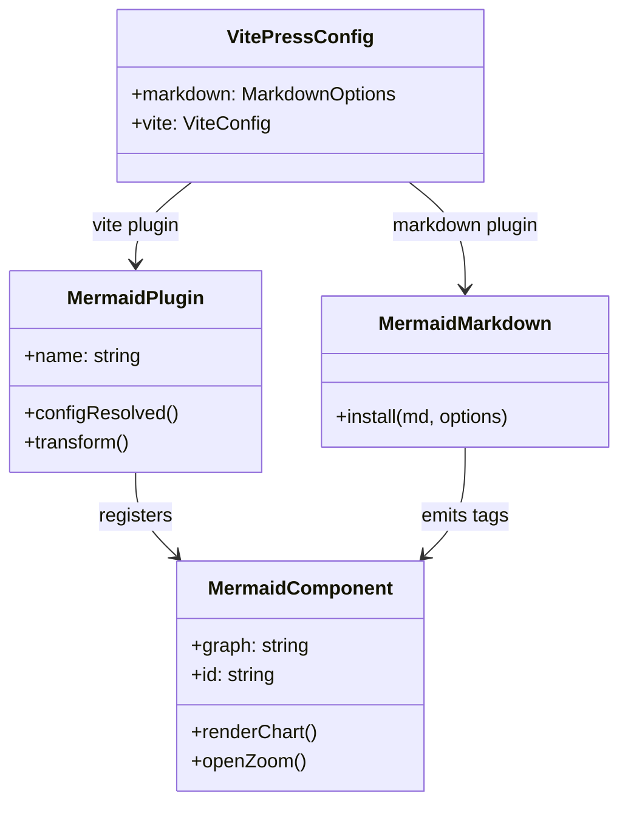
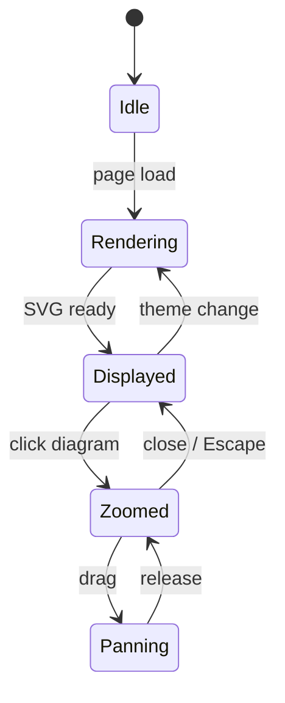
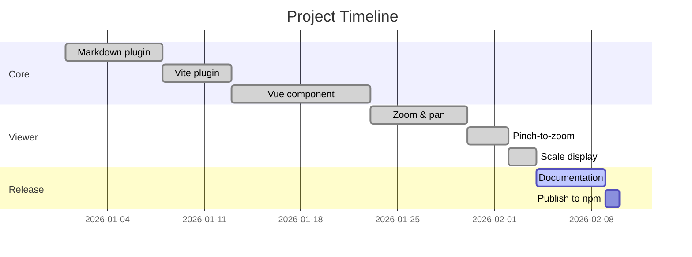
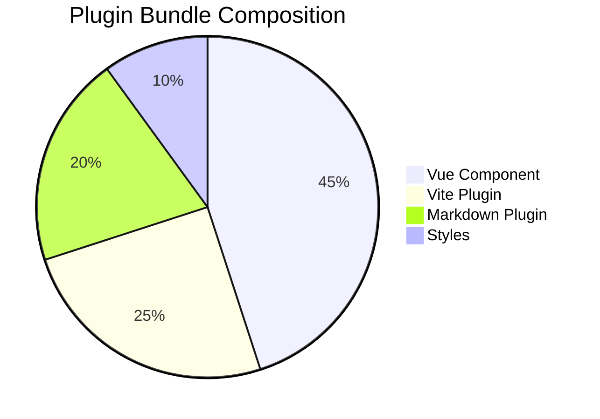
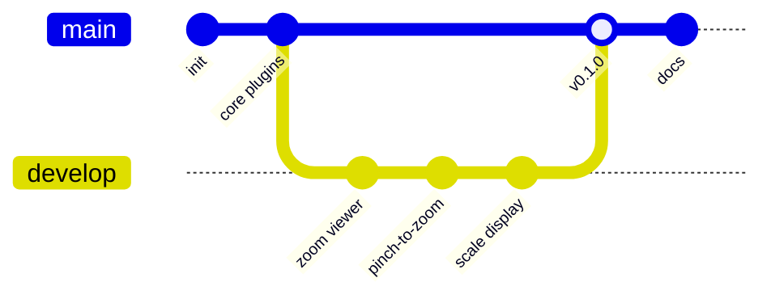

# Examples

Click any diagram below to open the interactive viewer. Use mouse wheel, pinch, or buttons to zoom.
Drag to pan.

## Flowchart

## Sequence Diagram

## Class Diagram

## State Diagram

## Gantt Chart

## Pie Chart

## Git Graph

